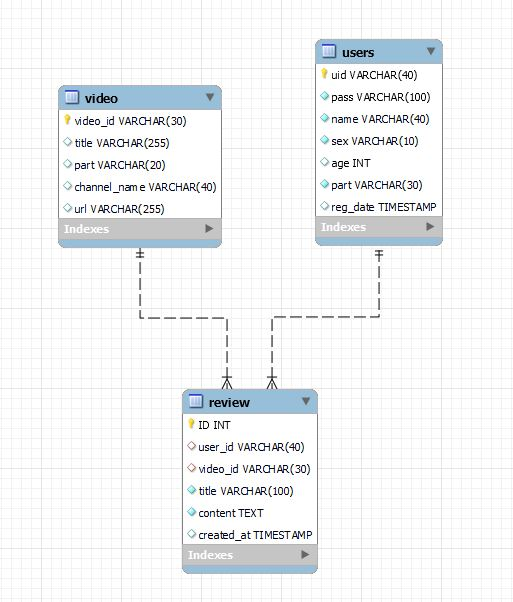

# SSAFIT Project
----------
## 1. 목표
- 제시된 요구사항을 분석하고 요구사항에 대한 DB 모델링을 할 수 있다.
- DB 모델링 된 엔티티를 테이블로 구축할 수 있다.
- 프로젝트의 DB 영역의 역할을 이해하고, DB 데이터 연동을 위한 클래스를 구현할 수
있다.

## 2. 팀원 및 역할 분담
- **최보성**: 운동 영상에 대한 리뷰를 관리할 수 있는 Table 설계
- **이윤준**: 메인페이지에 보여질 영상정보를 조회할 수 있는 Table 설계
- **김성현**: 회원을 관리할 수 있는 Table 설계, ER Diagram 작성

## 3. 진행 과정
1. 데이터를 저장할 Table을 video, user, review로 나누어 팀원끼리 하나씩 설계함
2. review Table 설계를 맡아 ID, title, writer, content, created_at이 포함된 review Table을 설계함
3. NOT NULL로 설계된 title, writer, content를 작성하여 Table에 넣을 수 있는 INSERT문을 만들어 5개의 예시를 포함한 Table을 구성함
4. 각자 만든 Table을 하나로 합치는 과정에서 review Table에 user_id, video_id를 추가하여 각 review를 어떤 user가 작성하였고 어떤 video에 작성하였는지 관계를 파악할 수 있도록 함
5. 설계된 DB 모델링에 맞게 ER Diagram을 작성함
- ER Diagram  

## 4. 느낀 점
- 같은 schema 내에 다른 Table 들에 대해서 서로의 관계를 통해 다른 Table에 영향을 줄 수 있다는 것을 알게 되었습니다.
- video Table과 user Table의 다대다 관계를 위해 review Table에 외래키를 사용함으로서 관계를 표현하는 법을 배우게 되었습니다.
- git을 활용하며 서로 다른 Table을 만든 후 합치는 과정에서 conflict가 나지 않도록 노력하며 git에 대해 다시 한번 알게 되었습니다.
- mySQL에서 ER Diagram을 작성하면서 ER Diagram에 대한 이해와 작성법을 알 수 있었습니다.
- review Table에 INSERT문을 실행시킬 때 video Table의 video_id에 오타가 있어 INSERT가 안 되었던 문제가 있었는데 이를 디버깅하며 서로 다른 테이블에서 외래키를 사용할 때 관계가 중요하다는 것을 알게 되었습니다.